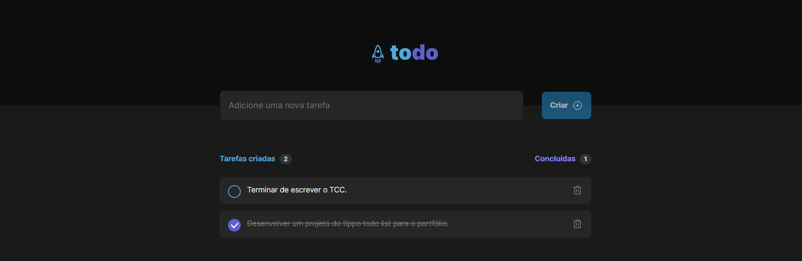

# to-do list (desafio 01) - Bootcamp Ignite - RocketSeat

> Fundamentos do ReactJS - Trilha 2022

Projeto desenvolvido como desafio para conclusão do módulo 1 do curso.

[🔗 Clique aqui para acessar]()

## 🔧 Tecnologias
- ReactJS
- HTML
- CSS
- Git e Github
- Vite

## ✉️ Contato
lauro.almeida@uniriotec.br